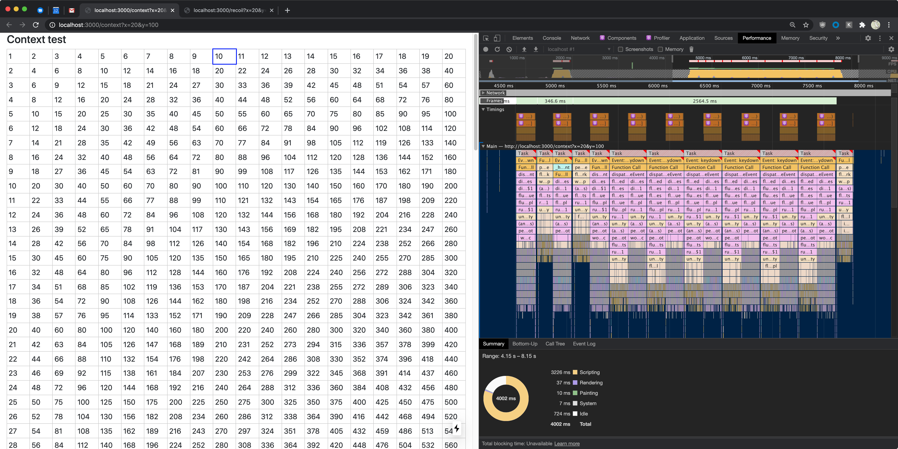
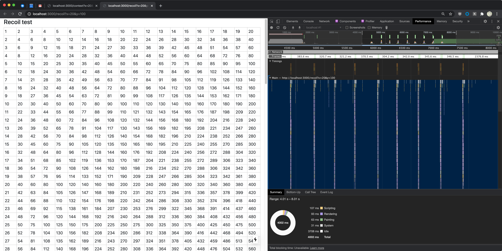

# recoil-vs-context-grid-test

This is an attempt to compare performance of a spreadsheet-like grid when using React Context vs. the [Recoil](https://recoiljs.org/) library for state management.

## Demo

https://saltycrane.github.io/recoil-vs-context-grid-test/

## Usage

```
$ npm install
$ npm run dev
```

Go to http://localhost:3000 in the browser

## Results

### Dev mode

When using [Dev mode](https://reactjs.org/docs/optimizing-performance.html#use-the-production-build), Recoil performed much better than React Context. Using a grid of 20 x 100 cells, I clicked the "100" cell and pressed the "Up Arrow" key 9 times until the "10" cell was selected. The React Context grid gave 18% (724ms / 4002ms) Idle time during this interaction. The Recoil grid gave 93% (3708ms / 4002ms) Idle time.

**Context Screenshot**


**Recoil Screenshot**


### Production mode

What's really important is performance in Production mode. I tried performing the same test using Production mode, but the Context and Recoil numbers looked similar. I tried increasing the grid size to 100 x 100 cells. The Context grid rendered fine, but the Recoil grid starting using a lot of memory and became unresponsive. I looked in the Recoil issues and found that memory leaks with `atomFamily` are a [known](https://github.com/facebookexperimental/Recoil/issues/366) [issue](https://github.com/facebookexperimental/Recoil/issues/471) and should be fixed by the next release. So I will leave this test as inconclusive until the memory leak issue is fixed.
