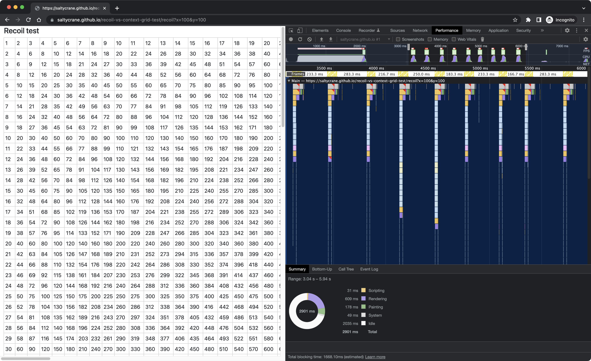

# recoil-vs-context-grid-test

This is an attempt to compare performance of a spreadsheet-like grid when using React Context vs. the [Recoil](https://recoiljs.org/) library for state management. It uses Recoil v0.4.1 and React v17.0.2.

## Demo

https://saltycrane.github.io/recoil-vs-context-grid-test/

## Usage

```
$ npm install
$ npm run dev
```

Go to http://localhost:3000 in the browser

## Results

### Dev mode

When using [Dev mode](https://reactjs.org/docs/optimizing-performance.html#use-the-production-build), Recoil performed much better than React Context. Using a grid of 20 x 100 cells, I clicked the "100" cell and pressed the "Up Arrow" key 9 times until the "10" cell was selected. The React Context grid gave 18% (724ms / 4002ms) Idle time during this interaction. The Recoil grid gave 93% (3708ms / 4002ms) Idle time.

**Context Screenshot (dev mode)**


**Recoil Screenshot (dev mode)**


### Production mode

What's really important is performance in Production mode. I increased the grid size to 100 x 100 cells and performed the same test pressing the "Up Arrow" key 9 times. The React Context grid gave 64% (3180ms / 4932ms) Idle time during this interaction. The Recoil grid gave 60% (2951ms / 4931ms) Idle time. They performed about the same.

**Context Screenshot (prod mode)**


**Recoil Screenshot (prod mode)**

